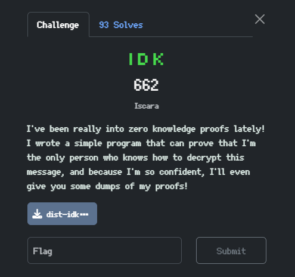
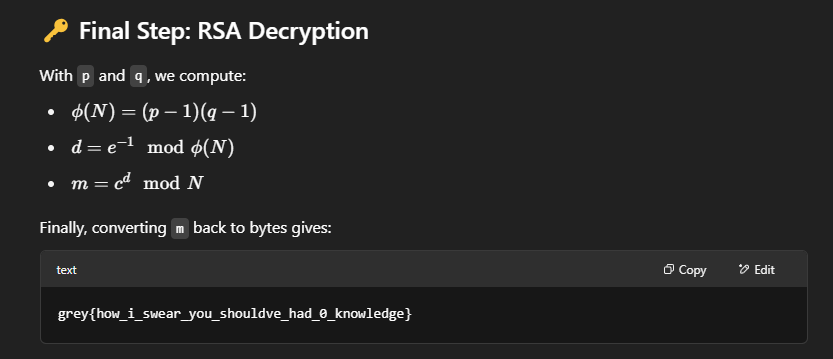

📝 Challenge Summary
We were given 5 files:

message.txt: Contains RSA public key (N, e) and a ciphertext c

dump1.txt and dump2.txt: Each contains hundreds of hex values and begin with the line 746869735f69735f615f736563726574 — which is hex for this_is_a_secret

prover.py: Script that performs a zero-knowledge proof protocol using p, q, and F_bytes = b'this_is_a_secret'

verifier.py: Confirms correctness of a proof without knowing p and q

Our goal was to decrypt the ciphertext encrypted under RSA using an unknown private key.

🔍 Analysis
🔑 1. Understanding the RSA Setup
message.txt gave us:

617-digit RSA modulus N

Standard public exponent e = 65537

Ciphertext c

This fits a standard RSA encryption:

But N is too large to factor directly, and the prover.py uses fake primes (p = q = 1337), so they’re no help.

🧠 2. Understanding the Proof Protocol
The prover.py script constructs a zero-knowledge proof based on a secret value F_bytes = b'this_is_a_secret', which is used to:

Deterministically generate values rho_i and theta_j using SHA256

Compute roots modulo N using p, q, and Tonelli–Shanks

Construct two lists:

sigmas: roots of rho_i

mus: square roots of theta_j, or 0

These values are sent to a verifier that only knows N and F_bytes, to confirm the prover has the secret key without leaking it.

⚠️ Key Insight
Both dump1.txt and dump2.txt start with the same hex string:

bash
Copy
Edit
746869735f69735f615f736563726574 → b'this_is_a_secret'
That means both dumps came from the same challenge session with the same inputs. The only variation is the random bit flip that may flip the sign of a square root.

So: the two dumps likely contain different roots for the same values.

🔓 Exploit: Recovering p and q
This is a classic RSA vulnerability:

If you know two different square roots 

🧮 Recovered Prime

p = 14226023...5801 (617-bit number)
q = N // p
🔑 Final Step: RSA Decryption

grey{how_i_swear_you_shouldve_had_0_knowledge}

✅ Conclusion
The challenge was a great exercise in exploiting ZKP transcripts and understanding how leaking alternate square roots can fatally compromise RSA. Even though the zero-knowledge protocol is sound, reusing the same parameters (F_bytes) and leaking multiple runs gave just enough info to break the system.

all vibe solved with chatgpt.