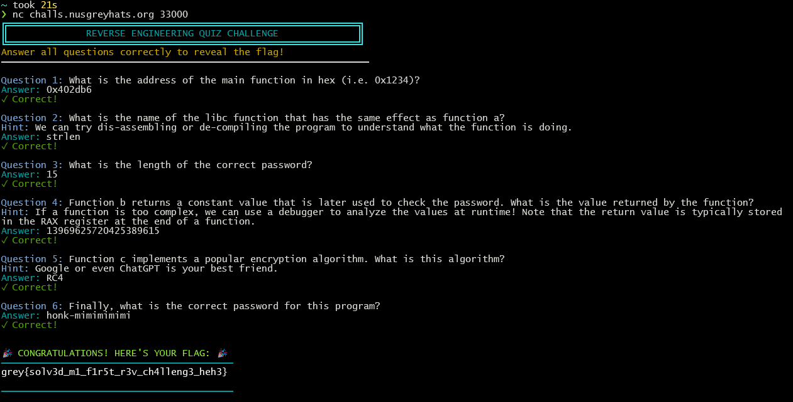

grey{solv3d_m1_f1r5t_r3v_ch4lleng3_heh3}

1.

2.What Function a Does
Input: A pointer to a null-terminated string (char *str).

Process:

Checks if the first byte is \0, returns 0 if so.

Otherwise, loops through the string byte-by-byte until it hits \0.

Counts how many bytes it passed through.

Output: The number of non-null bytes = string length.

🔁 Equivalent libc Function
strlen() — it does exactly what this function is doing.

Function a is a manual reimplementation of strlen

3.dissamble ghidra and go to main funtion:
Call Function a()


iVar1 = a(&local_118);
if (iVar1 == 0xf) {
Calls function a() with the input string.
}
Checks if the return value is 0xf (decimal 15).

4.Function b 
```bash
(gdb) break b
Note: breakpoints 1 and 2 also set at pc 0x40121f.
Breakpoint 3 at 0x40121f
(gdb) run
Starting program: /home/ha1qal/chal
[Thread debugging using libthread_db enabled]
Using host libthread_db library "/lib/x86_64-linux-gnu/libthread_db.so.1".
please input the correct password: aaaaaaaaaaaaaaa

Breakpoint 1, 0x000000000040121f in b ()
(gdb) finish
Run till exit from #0  0x000000000040121f in b ()
0x0000000000402f7b in main ()
(gdb) print $rax
$1 = -4477118353284162001
(gdb)
```

Let's convert it to unsigned 64-bit and also to hex:
2^64 = 18446744073709551616
unsigned_value = 18446744073709551616 - 4477118353284162001
               = 13969625720425389615

5.Analyze the c function and it will come out as RC4 encryption.

6.With all the hint given in the question:
-key = 13969625720425389615 (from question 3)
-cyphertext = d158158aeeb5bb520c6ba4ab6d7db7(got from enc function)


-encryption method = RC4 encryption

```python
from Crypto.Cipher import ARC4

# The ciphertext you provided
ciphertext = bytes.fromhex('d158158aeeb5bb520c6ba4ab6d7db7')

# The number you gave, converted to 8 bytes in little endian
key_num = 13969625720425389615
key = key_num.to_bytes(8, byteorder='little')

rc4 = ARC4.new(key)
plaintext = rc4.decrypt(ciphertext)

print("Decrypted password:", plaintext)
```

Decrypted password: b'honk-mimimimimi'
