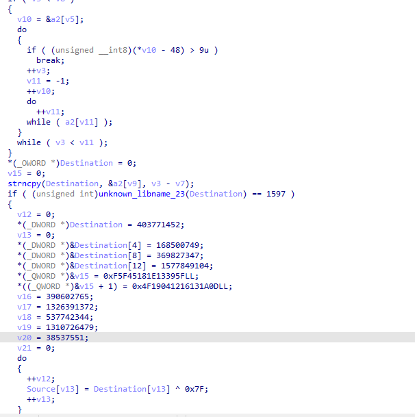

given a crackmes.exe file so i decompile using ida because i used ghidra and it doesnt show any lead.



In the binary, we see several hardcoded DWORD and QWORD values that are used to reconstruct a 52-byte buffer. These constants are written into a buffer named Destination, which is later XORed with 0x7F to produce the final decrypted output. The DWORDs represent 4-byte chunks and the QWORDs represent 8-byte chunks. They are not pointers to strings, but rather literal data used in the decryption process — likely forming the flag or a message after XOR decryption.

so heres the script do et the flag 
```python
>>> from struct import pack
>>> 
>>> buf = b""
>>> 
>>> # DWORDs
>>> buf += pack("<I", 403771452)     # 0x1805747C
>>> buf += pack("<I", 168500749)     # 0x0A0D0C1D
>>> buf += pack("<I", 369827347)     # 0x1604124F
>>> buf += pack("<I", 1577849104)    # 0x5E6C7A70
>>> 
>>> # QWORDs
>>> buf += pack("<Q", 0x0F5F45181E13395F)
>>> buf += pack("<Q", 0x4F19041216131A0D)
>>> 
>>> # More DWORDs
>>> buf += pack("<I", 390602765)     # 0x174C17BD
>>> buf += pack("<I", 1326391372)    # 0x4F05F10C
>>> buf += pack("<I", 537742344)     # 0x20047D38
>>> buf += pack("<I", 1310726479)    # 0x4EFC0F8F
>>> buf += pack("<I", 38537551)      # 0x024B02AF
>>> 
>>> # XOR with 0x7F
>>> decrypted = bytes([b ^ 0x7F for b in buf])
>>> print(decrypted.decode(errors='ignore'))
Congratulations! Flag: prelim{f0r_7h3_p0w3r_0f_10v3}
```